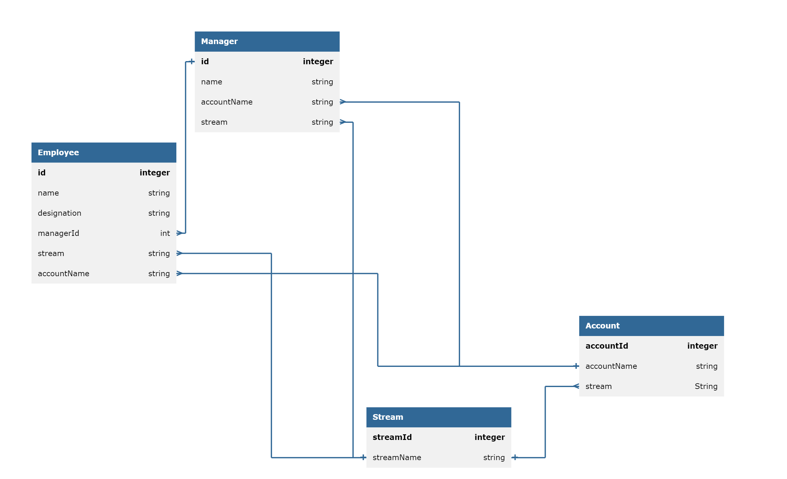
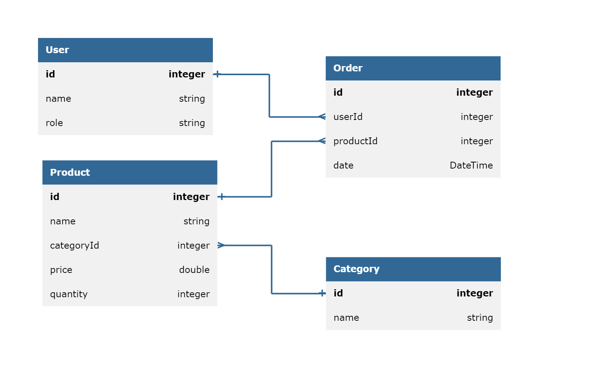

# Employee

## Entity design



## API Methods
1. **POST /api/v1/employee**
   ### *To add an employee:*
   - request-body : 
   ```json
    {
        "name"  : "Peter Parker",
        "designation" : "Manager",
        "accountName" : "Smart ops",
        "manager" : 0
    }
    ```
    - response-status : 200
    - response-body :
    ```json
    {
        "message" : "Successfully created",
         "id" : 1
    }
    ```

2. **GET /api/v1/employees?starts-with={letter}**
     ### *To get employee details of employees' whose name  starts with a specific letter:*
    - request-param : starts-with [required : true]
    - response-status : 200
    - response-body : employee details as JSON
    ```json
     {
        "id" : 1,
        "name"  : "Peter Parker",
        "designation" : "Manager",
        "accountName" : "SmartOps",
        "manager" : 0
     }
    ```
3. **GET /api/v1/streams**
   ### *To get details of all streams:*
    - response-status : 200
    - response-body : streams details as JSON
    ```json
    {
        "streams" : [
            {
                "id" : 1,
                "name": "Sales"
            },
            {
                "id" : 2,
                "name": "Delivery"
            }
        ]
    }
    ```
4. **PUT /api/v1/employees?employee-id={employee_id}&manager-id={manager_id}&account-name={account_name}&designation={designation}**
   ### *To update details of employee:*
    - request-param : employee-id [required : true]
    - request-param : manager-id [required : false]
    - request-param : account-name [required : false]
    - request-param : designation [required : false]
    - response-status : 200
    - response-body : 
    ```json
     {
        "message" : "Peter Parker's details has been changed."
     }
    ```


# Inventory Management System

## Entity



## API Methods

1. POST /api/v1/product
   ### *To add a product:*
   - request-body:
   ```json
        {
            "productName": "Product_Name",
            "categoryId": 789,
            "price": 500.75,
            "quantity": 10
        }
   ```
   - response-status : 201
   - response-body:
   ```json
    {
        "message":"Successfully created",
        "id": 101
    }
   ```
2. POST /api/v1/category
   ### *To add a category:*
   - request-body:
   ```json
    {
        "name":"Category_Name",
    }
   ```
   - response-status : 201
   - response-body:
   ```json
    {
        "message":"Successfully created",
        "Id":789
    }
   ```
3. GET api/v1/products?product-id={productId}&category_id={categoryId}
    ### *To get details of product:*
   - request-param : product-id [required = false]
   - request-param : category-id [required = false]
   - response-status:200
   - response-body:
   ```json
        { 
        "products":[ 
                {
                "productId":123,
                "productName":"Product_Name",
                "categoryId":789,
                "price":500.75,
                "quantity":10
                }
            ]
        }
   ```

4. GET /api/v1/category?category-id={categoryId}
   ### *To get details of a category:*
   - request-param : category-id [required = true]
   - response-status:200
   - response-body:
   ```json
        {  
            "details":
                {
                "categoryId":123,
                "categoryName":"Name",
                }
        }
   ```
5. PUT /api/v1/product
   ### *To update product details:*
   - request-body :
   ```json
    {
        "productId":123,
        "productName":"New_Product_ Name",
        "categoryId":789,
        "price":600,
        "quantity":100
    }
   ```
   - response-status:200
   - response-body:
   ```json
    {
        "message":"Successfully updated product details"
    }
   ```
6. PUT /api/v1/category
    ### *To update category name:*
   - request-body :
   ```json
    {
        "categoryId":123,
        "Name":"New_Category_Name"
    }
   ```
   - response-status:200
   - response-body:
   ```json
    {
        "message":"Successfully updated category name"
    }
   ```
7.  DELETE /api/v1/product?product-id={productId}
    ### *To delete a product using its ID*
       - request-param:product-id [required = true]
       - response-status:200
       - response-body:
       ```json
        {
            "message":"Successfully deleted product"
        }
       ```
8.  DELETE /api/v1/category?category-id={categoryId}
    ### *To delete a category using its ID*
       - request-param:category-id [required = true]
       - response-status:200
       - response-body:
   ```json
         {
             "message": "Successfully deleted category"
         }
   ```
9.  PUT /api/v1/orders?product-id={productId}&quantity={quantity}&user-id={userId}
    ### *To create an order to buy an item:*
    - request-param:product-id [required = true]
    - request-param:quantity [required = true]
    - request-param:user-id [required = true]
    - response-status:200
    - response-body:
    ```json
     {
        "message": "Successfully ordered"
     }
    ```
10. PUT /api/v1/stock?product-id={productId}&quantity={quantity}&user-id={userId}
    ### *To create an order to restock an item:*
    - request-param:product-id [required = true]
    - request-param:quantity [required = true]
    - request-param:user-id [required = true]
    - response-status:200
    - response-body:
    ```json
     {
        "message": "Successfully restocked"
     }
    ```
