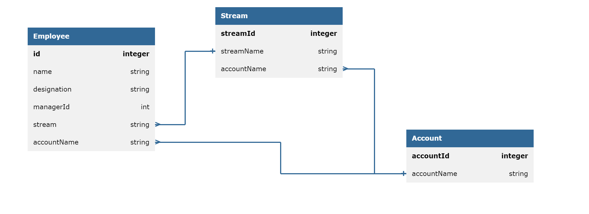
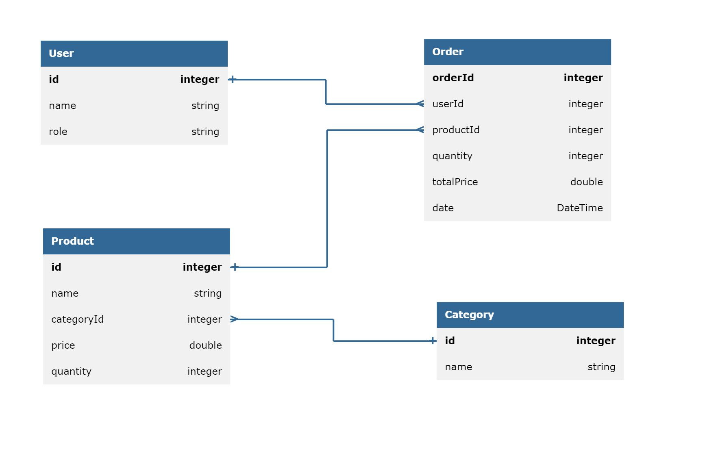

# Employee

## Entity design



## API Methods

1. GET /api/v1/employees?starts-with={letter}
    - request-param : starts-with [required : true]
    - response-status : 200
    - response-body : employee details as JSON
    ```json
    {
        "id" : 1,
        "name"  : "Peter Parker",
        "designation" : "Manager",
        "accountName" : "Smart ops",
        "manager" : ""
    }
    ```
2. GET /api/v1/streams 
    - request-param-required : false
    - response-status : 200
    - response-body : streams details as JSON
    ```json
    {
        "streams" : ["stream1","stream2","stream3"]
    }
    ```
3. PUT /api/v1/employees?employee-id={employee_id}&manager-id={manager_id}&account-name={account_name}&designation={designation}
    - request-param : employee-id [required : true]
    - request-param : manager-id [required : false]
    - request-param : account-name [required : false]
    - request-param : designation [required : false]
    - response-status : 200
    - response-body : 
    ```json
    {
        "message" : "Peter Parker's Manager has been changed from May to Tony"
    }
    ```


# Inventory Management System

## Entity



## API Methods

1. POST /api/v1/newProduct
   - request-body:
   ```json
    {
        "productId": "123",
        "productName": "Name",
        "categoryId": "789",
        "price": 500,
        "quantity": 10
    }
   ```
   - response-status : 201
   - response-body:
   ```json
   {
       "message":"Product is successfully created"
   }
   ```
2. POST /api/v1/newCategory
   - request-body:
   ```json
   {
       "categoryId":"789",
       "name":"Name",
   }
   ```
   - response-status : 201
   - response-body:
   ```json
   {
       "message":"Category is successfully created"
   }
   ```
3. GET /api/allProducts
   - request-body-required : false
   - response-status:200
   - response-body:
   ```json
    { 
        "products":
        [ 
        {
        "productId":"123",
        "productName":"Name",
        "categoryId":"789",
        "price":500,
        "quantity":10
        }
        ]
    }
   ```
4. GET /api/productsByCategory
   - request-param : categoryId [required = true]
   - response-status:200
   - response-body:
   ```json
   [
       {
       "productId":"123",
       "productName":"Name",
       "categoryId":"789",
       "price":500,
       "quantity":10
       }
   ]
   ```
5. GET /api/productsById
   - request-param : productId [required = true]
   - response-status:200
   - response-body:
   ```json
   [
       {
       "productId":"123",
       "productName":"Name",
       "categoryId":"789",
       "price":500,
       "quantity":10
       }
   ]
   ```
6. GET /api/categoryById
   - request-body-required : true
   - request-param : categoryId
   - response-status:200
   - response-body:
   ```json
   [
       {
       "categoryId":"123",
       "categoryName":"Name",
       }
   ]
   ```
7. PUT /api/updateProduct
   - request-body :
   ```json
   {
       "productId":"123",
       "productName":"Name",
       "categoryId":"789",
       "price":500,
       "quantity":10
   }
   ```
    - response-status:200
   - response-body:
   ```json
   {
       "message":"Successfully updated product"
   }
   ```
8. PUT /api/updateCategory
   - request-body :
   ```json
   {
       "categoryId":"123",
       "Name":"Name"
   }
   ```
   - response-status:200
   - response-body:
   ```json
   {
       "message":"Successfully updated category"
   }
   ```
9. DELETE /api/deleteProduct
   - request-param:productId
   - request-param-required:true
   -response-status:200
   - response-body:
   ```json
   {
       "message":"successfully deleted product"
   }
   ```
10. DELETE /api/deleteProduct
   - request-param:categoryId
   - request-param-required:true
   - response-status:200
   - response-body:
   ```json
   {
       "message": "successfully deleted category"
   }
   ```
11. PUT /api/sell
    - request-param:productId
    - request-param:quantity
    - response-status:200
    - response-body:
    ```json
    {
        "message": "successfully sold"
    }
    ```
12. PUT /api/restock
    - request-param:productId
    - request-param:quantity
    - response-status:200
    - response-body:
    ```json
    {
        "message": "successfully restocked"
    }
    ```
